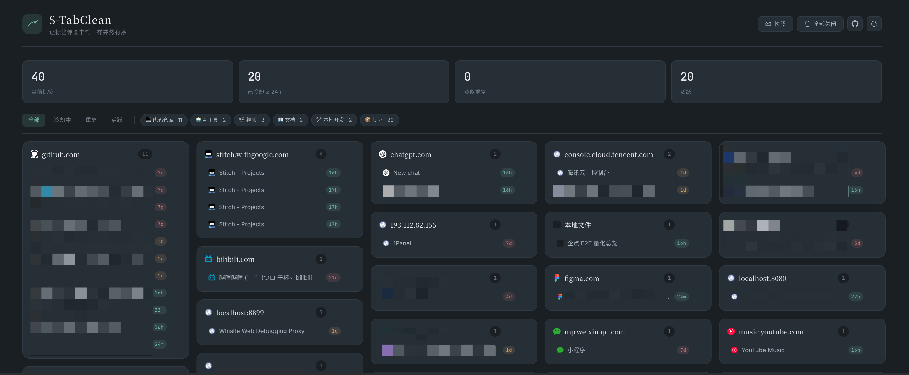

<div align="center">

# 🐦 S-TabClean

**A calm, local-first new-tab page that turns your Chrome tabs into an organised, recoverable workshop.**

[](https://developer.chrome.com/docs/extensions/mv3/intro/)
[](./LICENSE)
[](#-features)
[](#-tech-stack)

[English](./README.md) · [简体中文](./README.zh-CN.md)

</div>

---

## 📖 Overview

**S-TabClean** replaces Chrome's new-tab page with an *ink-and-bamboo* control surface for every tab you currently have open. It groups them by domain into a five-column masonry wall, surfaces stale or duplicate tabs at a glance, lets you snapshot whole sessions for later, and closes things down with a quiet sumi-e fade — never with a brutal modal.

It is **fully local**, **dependency-free**, and ships as a single Manifest V3 extension you can sideload in seconds.

> *Order is another kind of freedom.*

---

## 📑 Table of Contents

- [Features](#-features)
- [Screenshots](#-screenshots)
- [Installation](#-installation)
- [Usage](#-usage)
- [Tech Stack](#-tech-stack)
- [License](#-license)

---

## ✨ Features

| Capability | Description |
|---|---|
| 🧱 **Masonry grouping** | Tabs are auto-clustered by hostname into a fixed 5-column shortest-column-first masonry layout that adapts down to 4 / 3 / 2 / 1 columns. |
| 🧠 **Smart auto-tags** | Heuristic classification across *Code, AI, Video, Docs, Mail, Shopping, Social, Tools* — extensible via a single rule array. |
| ⏰ **Time decay** | Each tab shows how long it has been idle; cooled tabs (≥ 24 h) and frozen ones (≥ 72 h) get distinct pills. |
| 📚 **Session snapshots** | One-click named snapshots of all open tabs, restorable in a single window. |
| ⚡ **Command palette** | `⌘ / Ctrl + K` to fuzzy-jump or close any tab without leaving the keyboard. |
| 🌗 **Dual themes** | *Ink · Night* (default dark) and *Bamboo · Day*; persisted across sessions. |
| 💧 **Sumi-e fade** | Original closing animation: ink-bleed + blur + height collapse, with a soft Web-Audio chime. |
| 🪞 **Duplicate detection** | Identical URLs are flagged with an `×N` pill so you can dedupe at a glance. |
| 🧮 **Incremental reconcile** | External tab changes are diffed and patched in-place — never a full re-render. |
| 🔒 **100 % local** | No backend, no telemetry, no account. Settings live only in `chrome.storage.local`. |

---

## 🖼 Screenshots



---

## 🚀 Installation

### Option A — Load unpacked (developer mode)

```bash
git clone https://github.com/lisiyuan0828/S-TabClean.git
cd S-TabClean
```

1. Open `chrome://extensions` in Chromium-based browsers (Chrome / Edge / Brave / Arc).
2. Enable **Developer mode** in the top-right corner.
3. Click **Load unpacked** and select the `extension/` directory.
4. Open any new tab — the workshop should appear.

### Option B — From a release zip

Download the latest `s-tabclean-x.y.z.zip` from the [Releases](https://github.com/lisiyuan0828/S-TabClean/releases) page, unzip, and follow steps 1 – 4 above against the unpacked folder.

---

## 🎮 Usage

| Action | How |
|---|---|
| Jump to a tab | Click its title |
| Close one tab | Hover the row → click the `×` |
| Close a whole group | Hover the group card header → click the trash icon |
| Filter by status | Top chips: *All / Cooling / Duplicate / Active* |
| Filter by category | Smart-tag chips beside the divider |
| Save a snapshot | Top-bar **Snapshot** → name → confirm |
| Restore a snapshot | Open the snapshot drawer → **Restore** |
| Close every tab | Top-bar **Close all** → confirm modal |
| Open the palette | `⌘ + K` (macOS) / `Ctrl + K` (Win/Linux) |
| Toggle theme | Top-bar 🌓 |
| Visit the repository | Top-bar GitHub icon |

---

## 🛠 Tech Stack

| Concern | Choice | Why |
|---|---|---|
| Extension runtime | Chrome Manifest V3 | Future-proof, service-worker based |
| Language | Vanilla ES2020 | Zero build step, instant load |
| Persistence | `chrome.storage.local` | Sync-ready (one-line swap) |
| Layout | CSS + JS shortest-column masonry | Stable on add / remove |
| Closing animation | CSS keyframes (`ink-fade`, `ink-dissolve`) + transform | GPU-friendly |
| Audio cue | Web Audio API (synthesised) | No audio assets shipped |
| Icons | SVG source → `sips` rasterised PNGs | Single source of truth |

---

## 📜 License

[MIT](./LICENSE) © Si-Yuan Li

---

<div align="center">
<sub>Built quietly. Updated rarely. Loaded instantly.</sub>
</div>
